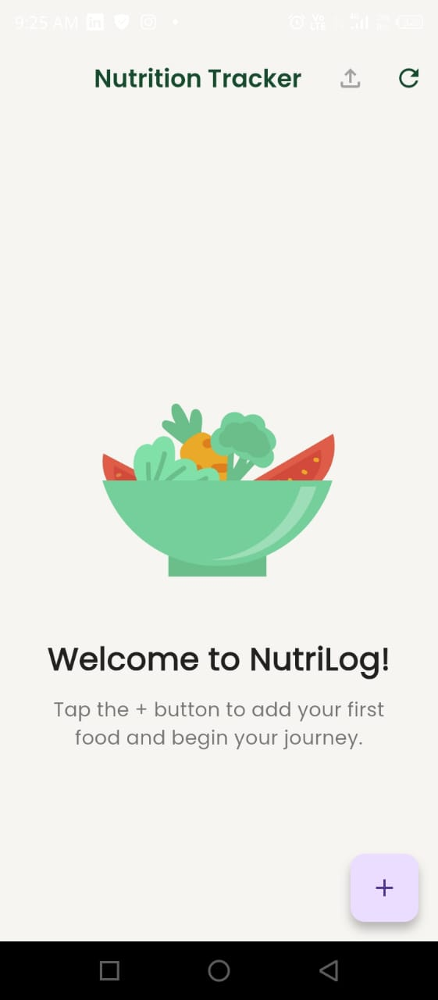
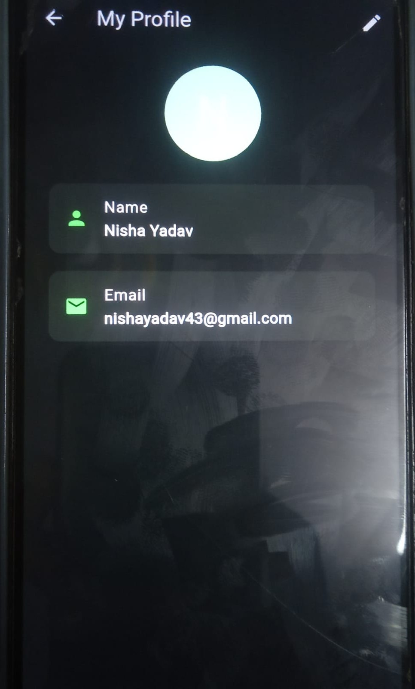

# 🥗 Nutrition Tracker App (Flutter + Firebase)

A feature-rich Flutter Nutrition Tracker application that helps users log daily food intake, track calories & macros, and manage nutrition using manual entry, voice input, AI food detection, and barcode scanning.

---

## 🚀 Features

### 🔐 Authentication
- Email & Password Login / Signup
- Firebase Authentication
- User Profile with editable name
- Secure Logout

### 🍽 Food Entry Methods
- Manual food entry
- Voice-based food input (Speech-to-Text)
- AI food detection from images (Roboflow)
- Barcode scanning using OpenFoodFacts API

### 📊 Nutrition Tracking
- Calories, Protein, Carbs, and Fats
- Daily grouped entries
- Interactive Pie Charts
- Real-time updates using Firestore

### ☁ Cloud & Data
- Firebase Firestore (Cloud Database)
- Real-time data sync
- CSV export support
- Image support for food entries

---

## 🛠 Tech Stack
- Flutter
- Firebase Authentication
- Cloud Firestore
- Speech-to-Text
- Roboflow API
- OpenFoodFacts API
- fl_chart
- mobile_scanner

---

## 📸 Demo Screenshots

### 🏠 Home Screen

### ➕ Add Food Entry

### 👤 Profile Page

---

## 🔧 Setup Instructions

1. Clone the repository
2. Run `flutter pub get`
3. Setup Firebase (Auth + Firestore)
4. Run `flutter run`

---

## 👨‍💻 Author
Anish

